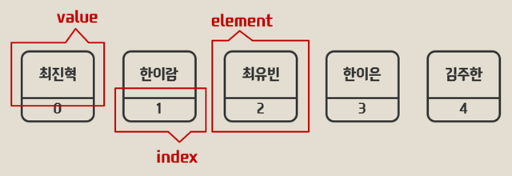

## 배열 (Array)  


- 거의 모든 언어에서 지원  
- 많은 데이터 <m>스트럭쳐들의 부품</m>으로 이용됨  
- 이미 알고있는 데이터 스트럭쳐  
- **어렵지 않다!**  
  
### 배열의 용도  

- 데이터가 적을땐 사용할 필요가 없다 -> **데이터가 많을 때** 필요하다!
- 데이터가 많아지면 **그룹관리**가 필요하다! 마치 학교에서 반을 나누는 것처럼!  
  
### 배열의 구성  

  
<small>배열의 구성<small>  

- **element**  
- **index**  
- **value**  

### 배열의 선언  

> 3가지 방법이 있다 어떤차이가 있는지 잘 비교해보자  

```java
    //아직 어떤 값이 배열에 들어갈지 모를 때 이렇게
   int[] numnbers1 = new int[4];
        
        //이런식으로 각 엘리먼트의 값을 초기화 해줄 수 있다.
        numnbers1[0] = 10;
        numnbers1[1] = 20;
        numnbers1[2] = 30;
        numnbers1[3] = 40;

        // 배열에 어떤값이 들어갈지 알고있을땐 이렇게
        int[] numnbers2 = {10,20,30,40};
        int[] numnbers3 = new int[]{10,20,30,40};
```  

> 배열의 값과 배열의 길이도 이렇게 출력해볼 수 있다.  

```java

  //참고로 값을 초기화 해주지 않았다면 자바의 자동초기화에 의해 0이 들어간다.  
  //참조형(객체)은 자동초기화될때 nyll들어감.
   System.out.println("numnbers1 = " + numnbers1[0]);
   System.out.println("numnbers1 = " + numnbers1.length);
```  

### 반복 Iteration  

> 배열의 데이터를 순차적으로 처리해야 할때 반복문을 사용해 처리한다.  


```java
//2가지 방법이 있다.
 int i = 0;
   while(i< numnbers1.length){
       System.out.println("numnbers1 = " + numnbers1[i]);
       i++;
  
   for(i = 0;i < numnbers1.length; i++){
       System.out.println("numnbers1 = " + numnbers1[i]);
   }

```  

### 배열의 장점과 단점  

> 배열은 다른 자료구조의 좋은 부품이 된다.  

- 배열은 크기가 정해져있고, 기능이 없다는 것이 **장점이자 단점**이다.  
- 크기가 정해져있어 크기가 **확정되어 있지 않은** 상황엔 난처하다.  
- 특별한 **기능이 없어서** 불편하다.  
- 반면에 크기가 정해져있어 **빠르고 메모리를 적게 사용**할 수 있다.  
- 이런저런 기능없이 <m>굉장히 컴팩트</m>하기 때문에 다른 **자료구조의 좋은 재료**가 될 수 있다.  


