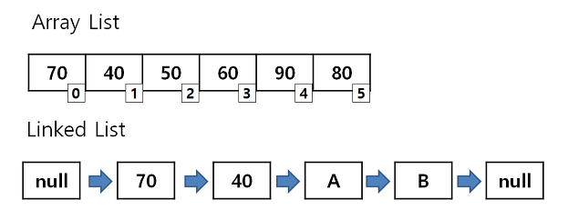

## Array vs ArrayList vs LinkedList  
 > 세 자료구조의 차이는 다음과 같다.  

 - Array는 index로 빠르게 값을 찾는 것이 가능.  
 - LinkedList는 데이터의 삽입 및 삭제가 빠름.  
 - ArrayList는 데이터를 찾는데 빠르지만, 삽입 및 삭제가 느림.  

### Array  

> index가 존재해 검색이 빠른 것이 장점  

  - 메모리에 할당할 사이즈는 선언할 때 정해야한다.  
    - 따라서 데이터가 계속 늘어날 때 or 최대 사이즈를 알 수 없을때는 부적합  
  - 중간의 데이터를 삽입/삭제할 때도 비효율적이다.  
    - 원래 값을 밀어내고 해당 index에 값을 덮어씌워야한다.  

> 이런 배열의 단점들을 해결하기위해 나온 것이 List다.  

### List  
> 배열처럼 크기를 정해주지 않아도 된다.  

- 대신, **순서**가 중요하다(Array에서는 index가 중요)  
- 크기가 정해져있지 않아서 중간에 데이터를 추가하거나 삭제하더라도 값이 누되거나 하지않는다.  
- index를 가지고 있어 **검색도 빠르다**.  
- 데이터 추가/삭제할때 시간이 오래걸리는 단점이 있다.(줄줄이 밀고당겨서)  

### LinkedList  
> 노드마다 다음 노드를 가리키는 포인터값을 가지고 있다.  

- 단일은 뒤의 노드만 가리킨다.  
- 다중은 앞뒤노드를 모두 가리킨다.  

> 이런 방식으로 데이터의 중간에 삽입/삭제를 하더라도 이전,다음값을 가리키던 주소값만 수정하여 연결시켜주면 된다.  
 - 대신 순차적으로 검색하게 되므로 검색에는 시간이 더 걸리는 단점이 있다.  
